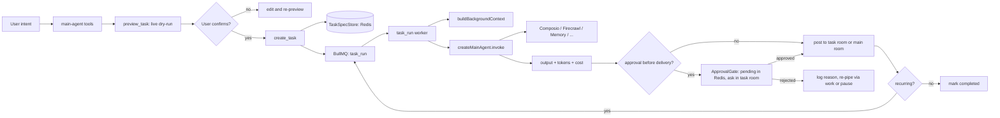

# Tasks Plugin — Async Tasks System — Technical Specification

**Status:** Spec-ready
**Author:** Yousef / QiForge
**Revision:** v1 — 2026-06-08
**Stack:** NestJS · BullMQ (Redis) · LangGraph/LangChain 1.x · Matrix · Zod · TypeScript · Vitest
**Supersedes:** `specs/ORA-165-tasks-module.md` (v3.0) and `specs/tasks/TASK-31-tasks-plugin.md` (port-as-is plan). Both are retired by this spec.

---

## What this is

A clean-sheet design for the bundled `tasks` plugin in `@ixo/oracle-runtime`. The product is one sentence: **run the agent on a schedule (or on a trigger), deliver the result.**

The previous attempt — `ORA-165` — designed an elaborate system around six task types, a Y.Doc + BlockNote "task page", chunked Matrix state-event indexes, a 700-line task-manager sub-agent prompt, and approval plumbing buried inside `MessagesService`. It worked, but creating a task felt like filing a tax return and editing the agent's behaviour required editing a wall of prose.

This rebuild collapses tasks down to a single primitive expressed in plain markdown, runs them out of one BullMQ queue, exposes a small set of tools directly on the main agent (no sub-agent), and stores everything in Redis behind a `TaskSpecStore` port so that when the runtime grows a real file-system abstraction we swap one adapter and keep going.

## Goals

| # | Goal |
|---|---|
| G1 | Schedule the main agent to run at a time or on a trigger, with the same toolset the agent has at request time. |
| G2 | Make task creation **safe by default** — no task is saved until a live dry-run has been shown to the user and confirmed. |
| G3 | Make the storage layer swappable. Redis today, file-system API tomorrow, no rewrite. |
| G4 | Re-implement the approval gate that was deleted in TASK-32b, entirely inside the plugin (zero edits to `MessagesService`). |
| G5 | Give complex / high-frequency tasks their own Matrix room. Don't flood the main chat. |
| G6 | Self-heal: when a task fails repeatedly, propose a spec edit instead of looping silently. |

## Non-goals

| # | Non-goal | Why |
|---|---|---|
| N1 | A new sub-agent for task management. | The main agent gets thin tools; no extra hop, no extra prompt to maintain. |
| N2 | A 6-axis task-type taxonomy. | Replaced by one primitive (`TaskSpec`). Behaviour comes from the spec body and the trigger, not from a `taskType` field. |
| N3 | Y.Doc / BlockNote / Matrix state events as task storage. | All replaced by Redis behind a port. |
| N4 | A bespoke web-search tool inside the plugin. | The work job inherits the main agent's toolset — Composio's search toolkits and Firecrawl cover this without a tasks-side dependency. |
| N5 | Token encryption (`apps/app/src/tasks/token-encryption.ts`). | UCAN handles per-call auth via `SecretsService`. The encryption shim is deleted. |
| N6 | Chunked task-index Matrix state events. | A single Redis hash per user is the index. Browsable via `list_my_tasks`. |
| N7 | Migrating live production tasks. | If any survive on `apps/app`, the team will recreate them post-cutover. No migration tooling. |

---

## Table of contents

### Part I — Concept

1. [Mental model](#1-mental-model)
2. [The four axes](#2-the-four-axes)
3. [The TaskSpec format](#3-the-taskspec-format)

### Part II — Architecture

4. [The plugin shape](#4-the-plugin-shape)
5. [Folder layout](#5-folder-layout)
6. [Storage — the `TaskSpecStore` port](#6-storage--the-taskspecstore-port)
7. [Triggers](#7-triggers)
8. [Dedicated task rooms](#8-dedicated-task-rooms)
9. [The approval gate](#9-the-approval-gate)
10. [Background `RuntimeContext`](#10-background-runtimecontext)
11. [The worker pipeline](#11-the-worker-pipeline)
12. [Credits, Composio, Firecrawl — what we inherit](#12-credits-composio-firecrawl--what-we-inherit)

### Part III — Surface

13. [Main-agent tools](#13-main-agent-tools)
14. [REST surface](#14-rest-surface)
15. [Shared state](#15-shared-state)

### Part IV — Operations

16. [Failure handling and self-healing](#16-failure-handling-and-self-healing)
17. [Cost accounting and budgets](#17-cost-accounting-and-budgets)
18. [Testing strategy](#18-testing-strategy)

### Part V — Delivery

19. [Build phases](#19-build-phases)
20. [Cutover and cleanup](#20-cutover-and-cleanup)
21. [Open follow-ups](#21-open-follow-ups)
22. [Glossary](#22-glossary)

---

# Part I — Concept

## 1. Mental model

A task is **"run my agent with this intent, at this time/trigger, deliver here."** Nothing else. One mental model:



That is the entire system. Every section below is a refinement of a single arrow.

## 2. The four axes

A task is `(trigger, intent, approval, delivery)`. Every behaviour falls out of those four axes.

| Axis | Values | Notes |
|---|---|---|
| **Trigger** | `time.once` · `time.cron` · `webhook` · `chain.after` | Phase 1 ships `time.*`. `webhook` + `chain.after` ship Phase 2. |
| **Intent** | Free-form markdown body of `spec.md` (sections `## What to do` / `## How to report` / `## Constraints`) | The agent reads this as a system instruction when the work job runs. No DSL. |
| **Approval** | `never` · `before-delivery` | Phase 1 ships both. A future expansion (L1–L4 autonomy ladder) is V2 only. |
| **Delivery** | `{ roomId, format }` where `roomId` is either `'main'` or a dedicated task room ID | The agent decides at create time whether to create a dedicated room (§8). |

There is no `taskType`. The job is always the same: invoke the main agent against the spec body, with the trigger context attached.

## 3. The TaskSpec format

`TaskSpec` is one markdown blob, YAML frontmatter + markdown body. This is what gets stored, what the user reads, what the agent edits. There is no parallel object format — the markdown **is** the spec.

```markdown
---
id: task_a1b2c3d4
owner: did:ixo:abc...
title: Morning Crypto Brief
trigger:
  type: time.cron
  pattern: "0 7 * * *"
  tz: Africa/Cairo
delivery:
  roomId: "!XYZ:matrix.ixo.earth"   # dedicated task room (or "main")
  format: report
approval: never                       # or "before-delivery"
budget:
  monthlyUsd: 5
modelTier: medium
status: active                        # draft | active | paused | failed-pending-review | completed | cancelled
stats:                                # maintained by the worker
  totalRuns: 0
  lastRunAt: null
  nextRunAt: "2026-06-09T05:00:00Z"
  consecutiveFailures: 0
  totalTokensUsed: 0
  totalCostUsd: 0
---

## What to do
Summarize BTC, ETH, SOL price action over the last 24h.
Highlight any moves > 5%. Pull from CoinGecko.

## How to report
Concise paragraph + bullet list of movers. Link sources.

## Constraints
- Under 300 words.
- No trade recommendations.
```

**Frontmatter schema:**

```ts
const TaskSpecFrontmatter = z.object({
  id: z.string().regex(/^task_[a-f0-9]{12}$/),
  owner: z.string(),                                 // user DID
  title: z.string().min(1).max(120),
  trigger: TriggerSchema,                            // discriminated union — §7
  delivery: z.object({
    roomId: z.union([z.literal('main'), z.string()]),
    format: z.enum(['message', 'report', 'json']).default('message'),
  }),
  approval: z.enum(['never', 'before-delivery']).default('never'),
  budget: z.object({ monthlyUsd: z.number().positive().optional() }).optional(),
  modelTier: z.enum(['low', 'medium', 'high']).default('medium'),
  status: z.enum(['draft', 'active', 'paused', 'failed-pending-review', 'completed', 'cancelled']).default('draft'),
  stats: TaskStatsSchema,
});
```

**Body shape:** three optional `##` sections, free markdown. The worker passes the body verbatim into the user-message slot of the agent invocation; the frontmatter never reaches the LLM.

**Why YAML frontmatter and not JSON next to a markdown body?** The user reads `spec.md` directly; YAML is friendlier to skim. The agent edits it via `update_task`, which round-trips through the Zod schema.

---

# Part II — Architecture

## 4. The plugin shape

```ts
// packages/oracle-runtime/src/plugins/tasks/tasks.plugin.ts
export class TasksPlugin extends OraclePlugin {
  name = 'tasks';

  manifest: PluginManifest = {
    title: 'Scheduled Tasks',
    summary: 'Schedule the agent to run at specific times or on triggers.',
    whenToUse: [
      "User asks to remind / schedule / set up a recurring report",
      "User says 'every morning', 'tomorrow at 5pm', 'when X happens'",
      "User wants the agent to watch something and report changes",
    ],
    whenNotToUse: [
      "One-shot action the user wants done right now — just do it",
    ],
    examples: [/* curated few-shot — see §13 */],
    category: 'automation',
    visibility: 'always',
    stability: 'beta',
  };

  configSchema = z.object({
    REDIS_URL: z.string(),
    TASKS_DEFAULT_TIMEZONE: z.string().default('UTC'),
    TASKS_MAX_PER_USER: z.coerce.number().int().positive().default(50),
    TASKS_DEFAULT_MONTHLY_BUDGET_USD: z.coerce.number().positive().default(10),
    TASKS_RUN_LOCK_TTL_SEC: z.coerce.number().int().positive().default(600),
  });

  autoDetect = (env: NodeJS.ProcessEnv) => Boolean(env.REDIS_URL);
  autoDetectHint = 'REDIS_URL';

  softDependsOn = ['memory'];   // memory enriches but is not required

  getTools(ctx: PluginContext): PluginTool[] {
    return [
      previewTaskTool(ctx),
      createTaskTool(ctx),
      listMyTasksTool(ctx),
      getTaskTool(ctx),
      updateTaskTool(ctx),
      pauseTaskTool(ctx),
      resumeTaskTool(ctx),
      cancelTaskTool(ctx),
      suggestSpecFixTool(ctx),
    ];
  }

  getMiddlewares(ctx: PluginContext): AgentMiddleware[] {
    return [approvalGateMiddleware(ctx)];
  }

  getNestModules(): Type<unknown>[] {
    return [TasksModule];
  }

  getAuthExcludedRoutes(): string[] {
    return ['/tasks/webhook/:taskId'];   // Phase 2
  }

  getSharedState() {
    return {
      myTasks:       (_state, rt: RuntimeContext) => this.indexFor(rt.user.did),
      pendingApprovals: (_state, rt: RuntimeContext) => this.pendingFor(rt.user.did),
    };
  }
}
```

The whole plugin surface is: 9 tools, 1 middleware, 1 Nest module, 2 shared-state accessors. No sub-agent.

## 5. Folder layout

```
packages/oracle-runtime/src/plugins/tasks/
├── tasks.plugin.ts
├── manifest.ts
├── index.ts
├── tasks.plugin.test.ts
└── internal/
    ├── tasks.module.ts                   # Nest module wired into RuntimeAppModule
    │
    ├── domain/
    │   ├── spec.ts                       # TaskSpec Zod + markdown ↔ object
    │   ├── trigger.ts                    # Trigger discriminated union
    │   └── run-summary.ts                # RunSummary shape
    │
    ├── store/                            # The TaskSpecStore port (§6)
    │   ├── task-spec.store.ts            # interface + DI token
    │   └── redis-task-spec.store.ts      # Phase-1 Redis implementation
    │
    ├── scheduler/
    │   ├── scheduler.service.ts          # BullMQ wrapper (enqueue/cancel/reschedule)
    │   ├── queues.ts                     # task_run + task_approval definitions
    │   └── triggers/
    │       ├── time.ts                   # cron + delay
    │       ├── webhook.ts                # Phase 2
    │       └── chain.ts                  # Phase 2
    │
    ├── worker/
    │   ├── task-run.worker.ts            # The hot path: load spec, run agent, deliver
    │   └── approval-timeout.worker.ts    # Reminder + expiry of pending approvals
    │
    ├── runtime/
    │   └── background-context.ts         # buildBackgroundContext({ userDid, sessionId? })
    │
    ├── delivery/
    │   ├── room-resolver.ts              # main room vs dedicated room policy
    │   ├── dedicated-room.service.ts     # create + invite + post spec.md
    │   └── post-result.ts                # render-and-post a RunSummary
    │
    ├── approval/
    │   ├── approval.service.ts           # Redis state + reminder/expiry scheduling
    │   ├── approval-gate.middleware.ts   # Pre-LLM intercept on user messages
    │   └── intent-classifier.ts          # Fast keyword path → tiny-LLM fallback
    │
    ├── controllers/
    │   ├── tasks.controller.ts           # GET /tasks, GET/:id, PATCH/:id, POST /:id/pause|resume|cancel
    │   └── webhook.controller.ts         # POST /tasks/webhook/:id (Phase 2)
    │
    ├── tools/                            # One tool per file
    │   ├── preview-task.ts
    │   ├── create-task.ts
    │   ├── list-my-tasks.ts
    │   ├── get-task.ts
    │   ├── update-task.ts
    │   ├── pause-resume-cancel.ts
    │   └── suggest-spec-fix.ts
    │
    └── templates/                        # Sample spec.md the agent can copy + fill (Phase 4)
        ├── morning-brief.md
        ├── url-monitor.md
        └── weekly-report.md
```

## 6. Storage — the `TaskSpecStore` port

Storage is the one piece this spec is opinionated about not committing to permanently. Today Redis is the only sensible answer (workers need to read it without UCAN/HTTP gymnastics; BullMQ is already there; latency is ~ms). Tomorrow the runtime will grow a real file-system abstraction (per-user, durable, browsable) and tasks should ride on that without a rewrite.

So everything goes through a port:

```ts
// packages/oracle-runtime/src/plugins/tasks/internal/store/task-spec.store.ts
export const TASK_SPEC_STORE = Symbol('TASK_SPEC_STORE');

export interface TaskSpecStore {
  // Spec — read/write the canonical markdown
  putSpec(taskId: string, markdown: string): Promise<void>;
  getSpec(taskId: string): Promise<string | null>;
  deleteSpec(taskId: string): Promise<void>;

  // Index — one row per task, keyed by owner DID
  upsertIndex(owner: string, row: TaskIndexRow): Promise<void>;
  removeIndex(owner: string, taskId: string): Promise<void>;
  listIndex(owner: string, filter?: ListFilter): Promise<TaskIndexRow[]>;
  resolveOwner(taskId: string): Promise<string | null>;

  // Runs — append-only, bounded
  appendRun(taskId: string, summary: RunSummary): Promise<void>;
  listRuns(taskId: string, limit?: number): Promise<RunSummary[]>;

  // Locks — used by the worker for idempotent execution
  acquireRunLock(taskId: string, ttlSec: number): Promise<boolean>;
  releaseRunLock(taskId: string): Promise<void>;

  // Approval — pending output cache for the gate
  putPendingApproval(taskId: string, payload: PendingApproval, ttlSec: number): Promise<void>;
  getPendingApproval(taskId: string): Promise<PendingApproval | null>;
  getPendingApprovalForRoom(roomId: string): Promise<{ taskId: string; payload: PendingApproval } | null>;
  clearPendingApproval(taskId: string): Promise<void>;
}
```

**Phase-1 implementation: `RedisTaskSpecStore`.**

| Method | Redis key | Type |
|---|---|---|
| `putSpec` / `getSpec` | `tasks:spec:<taskId>` | STRING (markdown) |
| `upsertIndex` / `listIndex` | `tasks:index:<owner>` | HASH (`taskId → JSON row`) |
| `resolveOwner` | `tasks:owner:<taskId>` | STRING |
| `appendRun` / `listRuns` | `tasks:runs:<taskId>` | LIST (LPUSH + LTRIM 0 99) |
| `acquireRunLock` | `tasks:lock:<taskId>` | STRING (`SET NX EX ttl`) |
| `putPendingApproval` | `tasks:approval:<taskId>` + `tasks:approval-room:<roomId>` | STRING + STRING (both TTL'd) |

`TaskIndexRow` is deliberately compact so a typical `list_my_tasks` is one Redis call:

```ts
interface TaskIndexRow {
  id: string;
  title: string;
  status: TaskStatus;
  nextRunAt: string | null;
  triggerSummary: string;       // "every day at 7am Africa/Cairo"
  dedicatedRoomId?: string;
}
```

**Future swap:** when the runtime ships its file-system API, we add `FsTaskSpecStore` that writes `spec.md` to the user's per-user filesystem and keeps a tiny Redis row for index + locks + runs. Tools and worker code do not change.

## 7. Triggers

```ts
type Trigger =
  | { type: 'time.once';  runAtIso: string; tz: string }
  | { type: 'time.cron';  pattern: string;  tz: string }
  | { type: 'webhook';    secret: string }                    // Phase 2
  | { type: 'chain.after'; afterTaskId: string; on: 'success' | 'any' };   // Phase 2
```

**`time.once`** — Scheduler enqueues a `task_run` job with `delay = msUntil(runAtIso)`. After delivery, status → `completed`.

**`time.cron`** — Scheduler enqueues the first run with the same delay logic. The worker, after delivery, computes the next cron occurrence and enqueues the next `task_run` job. We do **not** use BullMQ's `repeat` option because cron-recompute-per-run is easier to test, easier to pause/resume, and immune to BullMQ repeat-key edge cases observed in the legacy system.

**`webhook`** (Phase 2) — `POST /tasks/webhook/:taskId` with an `X-Task-Secret` header. The controller validates HMAC against the spec's `trigger.secret`, then directly enqueues a `task_run` for that taskId.

**`chain.after`** (Phase 2) — The worker, after a successful run of task A, queries the index for tasks with `trigger.type === 'chain.after' && trigger.afterTaskId === A`, and enqueues one `task_run` per match. The chained job receives the parent run's output summary in its run context so the child agent can reference it.

The discriminated union means triggers can grow without touching the rest of the system.

## 8. Dedicated task rooms

Not every task gets a room. The default is to deliver into the user's main room. A dedicated room only gets created when:

1. The trigger fires more often than once per day (cron interval `< 24h`), OR
2. The trigger is `webhook` or `chain.after` (unknown frequency), OR
3. The user explicitly asks for one, OR
4. The intent body crosses a length threshold or mentions "track", "monitor", "ongoing".

The `create_task` tool accepts `dedicatedRoom: 'auto' | 'yes' | 'no'` (default `'auto'`). When `'auto'` triggers a room, the agent **asks the user first**:

> "This will run every 30 minutes — want a dedicated room so it doesn't flood your main chat? [yes / no]"

When a dedicated room is created:
- Name: `[Task] <title>`
- The plugin creates the room via `MatrixService`, invites the user.
- The first message in the room is the `spec.md` rendered as Matrix HTML (so the user can scroll back and see what they signed up for).
- All future deliveries, run summaries, and approval requests post into this room.
- The spec's `delivery.roomId` is set to the room's Matrix ID. Workers don't need to re-decide per run.

When `dedicatedRoom: 'no'`, `delivery.roomId = 'main'` and the room resolver looks up the user's main session room at delivery time.

## 9. The approval gate

This re-implements the plumbing deleted in TASK-32b — and it lives entirely inside the plugin. `MessagesService` does not learn about tasks.

### 9.1 Where the gate plugs in

The plugin registers `approvalGateMiddleware` via `getMiddlewares()`. The middleware is invoked **before** the LLM step in the main agent's graph for every user message.

### 9.2 Flow

1. **Pre-check.** Pull the inbound user message text. Read `tasks:approval-room:<roomId>` from `TaskSpecStore` (1 GET). If no pending approval exists for this room, return early — no-op.
2. **Fast classification (keywords).** Lowercase + trim the message; match against:
   - approve: `yes`, `y`, `ok`, `approve`, `approved`, `do it`, `go`, `ship`, `send`
   - reject: `no`, `n`, `cancel`, `reject`, `rejected`, `stop`, `don't`, `dont`
   - If a fast match hits, classification is decided. No LLM call.
3. **Slow classification (cheap LLM).** Only if the message is ambiguous, call the runtime's `low`-tier model with a tight prompt: *"Classify this reply to a pending approval as `approved`, `rejected`, or `other` (anything else). Return only the label."* Output is parsed; `other` falls through to the normal agent path (the user is talking about something else).
4. **Approved** → call `ApprovalService.approve(taskId)`: clear the Redis pending keys, look up the cached output, post it to the room via `delivery/post-result.ts`, append a `RunSummary` with `approved: true`.
5. **Rejected** → call `ApprovalService.reject(taskId, reasonOptional)`: clear pending keys, log a rejection summary, and re-enqueue the task (counted toward `consecutiveFailures`). If `consecutiveFailures` reaches the configurable threshold (default 3), set status to `failed-pending-review` and have `suggest_spec_fix` (§16) propose an edit.
6. **In all of approved/rejected**, the middleware **swallows the user's message** — it does not propagate to the LLM. The user sees a single confirmation message from the plugin.

### 9.3 Idempotency

The gate sets a one-shot Redis SETNX key `tasks:approval-resolved:<taskId>` with the same TTL as the pending payload. Late duplicates (BullMQ redelivery, Portal-vs-Matrix double ingress) hit this key and short-circuit.

### 9.4 Approval request location

Approval requests post to the spec's `delivery.roomId`. For tasks with a dedicated room, the ask lives there — consistent with where the user expects task activity. The `task_approval` queue schedules a reminder at 24h (re-post in the same room) and an expiry at 48h (mark `failed-pending-review`, clear pending).

### 9.5 Cross-plugin reuse

The plugin exports `APPROVAL_GATE_PORT` as a public Nest DI token so other plugins that want an approval gate (e.g. credits gating a large purchase) can call into the same Redis-backed gate without re-implementing it. The shape:

```ts
interface ApprovalGatePort {
  request(args: { taskId: string; roomId: string; preview: string; ttlSec?: number }): Promise<void>;
}
```

This is the only public Nest export the plugin exposes.

## 10. Background `RuntimeContext`

Workers run without an HTTP request. The runtime currently has no helper for building a `RuntimeContext` outside of `MessagesService`. The plugin ships one inside its own folder so we don't fork a runtime change for it. If it proves useful elsewhere, we promote it to the runtime later.

```ts
// packages/oracle-runtime/src/plugins/tasks/internal/runtime/background-context.ts
@Injectable()
export class BackgroundContextBuilder {
  constructor(
    private ucan: UcanService,
    private secrets: SecretsService,
    private sessions: SessionsService,
    private matrix: MatrixService,
    private llm: LlmAdapter,
    @Inject(AMBIENT) private ambient: AmbientServices,
  ) {}

  async build(args: { userDid: string; sessionId?: string; roomId?: string }): Promise<RuntimeContext> {
    const matrixUserId = didToMatrixUserId(args.userDid, this.matrix.homeServer);
    const runConfig: RunConfig = {
      context: {
        user: {
          did: args.userDid,
          matrixUserId,
          ucanDelegation: { raw: '' },     // worker acts as oracle; no end-user CAR
          timezone: 'UTC',
          currentTime: new Date().toISOString(),
        },
        session: {
          id: args.sessionId ?? `task-worker-${randomUUID()}`,
          client: 'matrix',
          requestId: randomUUID(),
          roomId: args.roomId,
        },
      },
    };
    return buildRuntimeContext(runConfig, this.ambient, { messages: [] });
  }
}
```

Notes:

- `ucanDelegation.raw = ''` is intentional — the worker is the oracle acting on the user's already-cached delegation. Plugins that need a user-signed UCAN at execution time (e.g. sandbox) must check whether the user's delegation is still cached. If not, those tools are unavailable for the run — handled gracefully, not crashed.
- The `AMBIENT` token is the existing per-boot services bag the runtime already injects. No new wiring.
- The session ID is synthetic when no real session is available. The agent treats this as a non-streaming background invocation.

## 11. The worker pipeline

`task_run.worker.ts` — the hot path. One handler, ~150 LOC.

```ts
@Processor(TASK_RUN_QUEUE)
export class TaskRunWorker {
  constructor(
    @Inject(TASK_SPEC_STORE) private store: TaskSpecStore,
    private contextBuilder: BackgroundContextBuilder,
    private scheduler: SchedulerService,
    private approval: ApprovalService,
    private roomResolver: RoomResolver,
    private postResult: PostResultService,
    @Inject(CREATE_MAIN_AGENT) private createMainAgent: CreateMainAgentFn,
    private cfg: TasksConfig,
  ) {}

  @Process()
  async handle(job: Job<{ taskId: string; runId: string; chainContext?: ChainContext }>) {
    const { taskId, runId, chainContext } = job.data;
    const owner = await this.store.resolveOwner(taskId);
    if (!owner) return logSkip('owner gone', taskId);

    const acquired = await this.store.acquireRunLock(taskId, this.cfg.runLockTtlSec);
    if (!acquired) return logSkip('locked', taskId);

    try {
      const spec = await loadSpec(this.store, taskId);
      if (!isRunnable(spec.status)) return;          // paused/cancelled — skip silently

      const rt = await this.contextBuilder.build({ userDid: owner });
      const agent = await this.createMainAgent(rt);

      const input = buildAgentInput(spec, chainContext);     // body becomes the user message
      const t0 = Date.now();
      const result = await agent.invoke(input);              // credits middleware applies automatically
      const durationMs = Date.now() - t0;

      const output = extractOutput(result);
      const usage = extractUsage(result);

      const deliveryRoom = await this.roomResolver.resolve(spec, owner);

      if (spec.approval === 'before-delivery') {
        await this.approval.requestApproval({
          taskId,
          roomId: deliveryRoom,
          preview: output.preview,
          fullPayload: output,
        });
      } else {
        await this.postResult.post(deliveryRoom, output, spec);
      }

      const summary: RunSummary = {
        runId, ranAtIso: new Date(t0).toISOString(),
        status: 'ok', durationMs,
        tokens: usage.tokens, costUsd: usage.costUsd,
        outputPreview: output.preview,
      };
      await this.store.appendRun(taskId, summary);
      await updateStatsAndReschedule(this.store, this.scheduler, spec, summary);

    } catch (err) {
      await onRunError(this.store, this.scheduler, taskId, runId, err);
    } finally {
      await this.store.releaseRunLock(taskId);
    }
  }
}
```

Two queues, one worker each:

| Queue | Concurrency | Retries | Notes |
|---|---|---|---|
| `task_run` | 5 (rate-limited 3/min) | 3 attempts, exponential backoff (30s base, max 5m) | The lock means redeliveries are safe. |
| `task_approval` | 10 | 3 attempts, fixed 10s | Carries reminder + expiry jobs only. |

## 12. Credits, Composio, Firecrawl — what we inherit

**Credits.** Already confirmed: the credits plugin installs a LangGraph middleware on the compiled main agent. When the worker calls `createMainAgent(ctx).invoke(state)`, the middleware applies unchanged. `beforeModel` aborts if `remaining ≤ 0`; `afterModel` deducts via `TokenLimiter.limit()`. **Nothing for the Tasks plugin to do.** A preview run is also a normal agent invocation, so it's metered just like any other LLM call.

**Composio.** The Composio plugin is `visibility: 'on-demand'`. When the work job's agent decides to send a Gmail or create a Linear issue, it calls `load_capability('composio')` and the toolkit becomes available for the rest of that invocation. Crucially, **the user's UCAN delegation must be cached** at run time for Composio to mint per-call invocations — same as for sandbox. If it isn't, Composio tools degrade gracefully (zero tools exposed).

**Firecrawl + Composio search.** Web search is handled via whichever the user has loaded. Firecrawl covers "scrape this URL"; Composio's search toolkits cover "find me X on the web". The Tasks plugin does not need its own search tool.

---

# Part III — Surface

## 13. Main-agent tools

All nine tools are registered via `getTools(ctx)` and are `visibility: 'always'`. There is no sub-agent. The agent sees them in its Tier-1 prompt.

### 13.1 `preview_task` — the safety rail

**Purpose:** run a candidate spec once, dry, before any persistence. Shows the user real output, real token count, real cost.

**Schema:**

```ts
input: z.object({
  title: z.string().min(1).max(120),
  intent: z.object({
    whatToDo: z.string().min(1),
    howToReport: z.string().optional(),
    constraints: z.array(z.string()).optional(),
  }),
  modelTier: z.enum(['low', 'medium', 'high']).default('medium'),
})
output: z.object({
  previewToken: z.string(),       // returned to create_task to prove a preview happened
  output: z.string(),             // the actual LLM output
  tokens: z.number(),
  costUsd: z.number(),
  durationMs: z.number(),
})
```

**Behaviour:**

1. Build a temporary `TaskSpec` shell with `id = 'preview_<uuid>'`, `status = 'draft'`, trigger left blank.
2. Build a `RuntimeContext` for the current user (we are in an HTTP request, so this is trivial — same path as the worker but with the real session).
3. Construct `createMainAgent(ctx)` and `.invoke(...)` with the body as input. Stream tokens to the active WebSocket session via `WsService` so the user sees output as it generates.
4. Capture final output + usage + cost.
5. Store a short-lived `previewToken` in Redis (`tasks:preview:<token>` → `{ owner, hash(spec), expiresAt }`, TTL 10m). Return the token to the agent.

**Why a token?** `create_task` requires the previewToken from a preview whose spec-hash matches what's being committed. This makes "preview then immediately schedule something completely different" impossible. If the user edits the spec after preview, the hash changes, and `create_task` will reject with `"please re-preview"`.

### 13.2 `create_task` — only after preview

**Schema:**

```ts
input: z.object({
  previewToken: z.string(),
  title: z.string(),
  trigger: TriggerSchema,
  intent: IntentSchema,
  delivery: z.object({
    roomId: z.union([z.literal('main'), z.string()]).optional(),
    format: z.enum(['message', 'report', 'json']).optional(),
  }).optional(),
  approval: z.enum(['never', 'before-delivery']).default('never'),
  budget: z.object({ monthlyUsd: z.number().positive() }).optional(),
  modelTier: z.enum(['low', 'medium', 'high']).optional(),
  dedicatedRoom: z.enum(['auto', 'yes', 'no']).default('auto'),
})
output: z.object({
  taskId: z.string(),
  roomId: z.string(),
  nextRunAt: z.string().nullable(),
  triggerSummary: z.string(),       // "every day at 7am Africa/Cairo"
})
```

**Behaviour:**

1. Validate the `previewToken` — hash, owner, freshness.
2. Resolve `dedicatedRoom` policy (§8). If `'yes'`, create the room and post `spec.md` as the opening message.
3. Render `spec.md` from inputs. Validate against the frontmatter Zod.
4. `putSpec` + `upsertIndex` via the store.
5. Enqueue the first `task_run` job through `SchedulerService`. For `time.cron`, this is the next-occurring time.
6. Return a confirmation summary the agent can paraphrase.

### 13.3 `list_my_tasks`

**Schema:** `{ filter?: { status?: TaskStatus[] } }` → `TaskIndexRow[]`. One Redis HGETALL. ~ms.

### 13.4 `get_task`

**Schema:** `{ taskId }` → `{ spec: TaskSpecFrontmatter; body: string; runs: RunSummary[] }`. Used to show the user "what does this task look like / how has it gone?".

### 13.5 `update_task`

**Schema:** `{ taskId, patch: { title?, trigger?, intent?, delivery?, approval?, budget?, modelTier? } }`. Returns the diff applied + the new `nextRunAt`.

**Behaviour:** load spec → apply patch → re-validate → `putSpec`. If `trigger` changed, cancel the active `task_run` job via `SchedulerService.cancel(taskId)` and re-enqueue.

### 13.6 `pause_task` / `resume_task` / `cancel_task`

Three thin tools, one Redis update each + a BullMQ remove or add. Status transitions are gated (cannot resume a `cancelled` task).

### 13.7 `suggest_spec_fix`

Used by `pause` of last resort: after `consecutiveFailures` ≥ threshold, the task is set to `failed-pending-review`. `suggest_spec_fix` reads the last N run summaries, asks the cheap-tier model to propose a markdown diff against `spec.md`, posts it in the conversation with `"Apply this fix?"`. On user approval, the agent calls `update_task` with the patch.

**The user is always in the loop.** No auto-apply.

### 13.8 Few-shot examples in the manifest

The manifest ships ~6 worked examples drawn from real use cases (remind me, recurring brief, watch a URL, weekly digest, one-shot research, chain). These do the prompt-engineering work that the legacy 700-line task-manager-prompt used to do.

## 14. REST surface

| Method | Path | Purpose | Auth |
|---|---|---|---|
| GET | `/tasks` | List my tasks | UCAN |
| GET | `/tasks/:id` | Get one | UCAN |
| PATCH | `/tasks/:id` | Update (admin/Portal flow) | UCAN |
| POST | `/tasks/:id/pause` | Pause | UCAN |
| POST | `/tasks/:id/resume` | Resume | UCAN |
| POST | `/tasks/:id/cancel` | Cancel | UCAN |
| POST | `/tasks/webhook/:id` | Fire (Phase 2) | HMAC header, **auth-excluded** |

Webhook is declared via `getAuthExcludedRoutes()` so `AuthHeaderMiddleware` skips it. The controller verifies `X-Task-Secret` against the spec's `trigger.secret` (constant-time compare).

## 15. Shared state

Two read accessors exposed via `getSharedState()`:

| Key | Reads | Consumers |
|---|---|---|
| `myTasks` | `store.listIndex(rt.user.did)` | Other plugins surfacing "what's the user automating?" |
| `pendingApprovals` | iterate the user's tasks, filter by pending | UI widgets, future user-preferences "do not disturb" hooks |

Both are lazy. Failure of one accessor does not affect the other.

---

# Part IV — Operations

## 16. Failure handling and self-healing

| Class | Detection | Response |
|---|---|---|
| Transient LLM error | Worker catches | BullMQ retries (3, exponential). On final fail, `consecutiveFailures++`, summary marked `error`. |
| User UCAN expired | Worker observes empty Composio/sandbox toolset | Best-effort — run with what's available. If output is empty, mark `error` and append a hint for the user in the run summary. |
| Spec validation broken | Edit / migration broke the frontmatter | Task auto-paused; agent surfaces the broken row on next `list_my_tasks` with a `🔧` hint. |
| Repeated rejection (approval) | Approval flow counts these toward `consecutiveFailures` | Same threshold path → `failed-pending-review`. |
| Threshold reached | `consecutiveFailures ≥ policy.maxConsecutiveFailures` (default 3) | Status → `failed-pending-review`. Agent posts in the task room: *"This task has failed 3 times. Want me to propose a fix?"* `suggest_spec_fix` is the followup. |

## 17. Cost accounting and budgets

- Per-run `costUsd` comes from the credits middleware's `afterModel` calculation, captured in the `RunSummary`.
- `spec.stats.totalCostUsd` is incremented monotonically.
- `spec.budget.monthlyUsd` is enforced by the worker: before invoking the agent, compute current-month spend from the runs LIST. If over budget, skip the run, append an `over-budget` summary, post a single notice in the task room (or main room) explaining the pause. Status → `paused` until the user resumes.
- The agent can change `budget.monthlyUsd` via `update_task`.
- A preview is metered like any other LLM call (per §12). No special casing.

## 18. Testing strategy

Three layers. Vitest throughout.

### 18.1 Unit

- `spec.ts` — round-trip markdown ↔ object, edge cases (missing sections, malformed cron, bad TZ).
- `redis-task-spec.store.ts` — happy path + lock contention via fakeredis.
- `intent-classifier.ts` — fast-path keyword table covered exhaustively, slow-path stubbed.
- `room-resolver.ts` — dedicated-room heuristic truth table.

### 18.2 Plugin-level

- Plugin loads when `REDIS_URL` is set; absent when not.
- `getTools` returns 9 tools.
- Middleware registered; integration with main-agent `getMiddlewares` chain.
- `approvalGateMiddleware` swallows + classifies + acts correctly using a mocked `TaskSpecStore`.

### 18.3 Integration

Single end-to-end test with `createTestRuntime`:

1. Preview a spec → assert output streamed, token returned.
2. `create_task` with the previewToken → assert spec stored, BullMQ job enqueued (with mock queue), task posted to room.
3. Run-time-trigger the worker manually (call the handler with the job) → assert the main agent was invoked + a delivery posted.
4. Inject a user "yes" reply → assert the approval gate intercepted, pending cleared, delivery posted.
5. Simulate 3 consecutive errors → assert status → `failed-pending-review` and `suggest_spec_fix` posts a diff.

We do **not** spin up real Redis or real BullMQ in unit tests; we use the test-runtime mocks. Integration tests that exercise real Redis run only in `--mode int` and are gated on `REDIS_URL` (throwing if missing, per the project's "no silent skips" rule).

---

# Part V — Delivery

## 19. Build phases

| Phase | Scope | Effort | Acceptance highlights |
|---|---|---|---|
| **0. Scaffold** | Plugin folder, manifest, empty Nest module, config schema, auto-detect on `REDIS_URL`, smoke test. | 0.5d | `tasks.plugin.test.ts` passes; plugin shows up in `app.plugins.status()` when `REDIS_URL` set. |
| **1. MVP** | Spec format + Zod; `TaskSpecStore` port + `RedisTaskSpecStore`; `task_run` + `task_approval` queues + worker; `BackgroundContextBuilder`; `time.once` + `time.cron`; 9 main-agent tools including `preview_task` (live dry-run, WS streaming) and `create_task` (preview-token gated); conditional dedicated room creation; approval gate middleware + `ApprovalService` + `APPROVAL_GATE_PORT`; delivery to main or dedicated room; cost + budget accounting; failure threshold → `failed-pending-review`. | **6d** | End-to-end: "every day at 7am summarize crypto" → preview → confirm → scheduled → fires → delivers. "Yes/no" replies handled. Over-budget pause works. |
| **2. More triggers** | `webhook` (controller + HMAC + auth-excluded route) + `chain.after` (post-run scan + enqueue). | 1d | `curl POST /tasks/webhook/:id -H "X-Task-Secret: …"` fires a task; chained task receives parent output. |
| **3. Self-healing** | `suggest_spec_fix` polished — reads run history, prompts low-tier model for a diff, posts via the room, awaits user approval. | 0.5d | After 3 errors, agent volunteers a fix and applies on user "yes". |
| **4. Templates** | `templates/*.md` shipped; few-shot in manifest so agent picks + fills automatically. | 0.5d | "Set up my morning brief" → one-turn template → preview → schedule. |
| **5. Cleanup + cutover** | Delete `apps/app/src/tasks/`; delete `token-encryption.ts`; remove stale references; carry forward any tests that still apply (most won't); update `specs/tasks/TASK-31-tasks-plugin.md` to point at this spec. | 0.5d | `pnpm lint`, `pnpm format:check`, `pnpm test` green across packages. |

**Total: ~8.5 days.** All wow features (preview, approval, conditional rooms) ship in Phase 1.

## 20. Cutover and cleanup

- **Delete** `apps/app/src/tasks/` in its entirety. No `git mv`. The new plugin shares almost no code with the legacy folder; carrying it forward would muddy diffs.
- **Delete** `apps/app/src/tasks/token-encryption.ts`. UCAN is in. The shim is dead.
- **Delete** any references in `apps/app` to `TasksService`, `ApprovalService`, `TasksScheduler`. (TASK-32b already cut most of these; this pass finishes them.)
- **Update** `specs/tasks/TASK-31-tasks-plugin.md` with a header pointing at `specs/tasks-async-system.md` and a note that the port-as-is plan is retired.
- **Update** `specs/ORA-165-tasks-module.md` with a `Superseded by: specs/tasks-async-system.md` header. Keep the file for historical context; do not delete.
- **Add** to `apps/qiforge-example` an opt-in example: a tiny `tasks/sample-spec.md` so a fork developer can see one. No code change needed in `main.ts` — the plugin is bundled and auto-detects on `REDIS_URL`.

No live-task migration. If production has running tasks on the legacy system at cutover time, the team will recreate them post-deployment using the new tools. (Confirmed scope decision.)

## 21. Open follow-ups

These are deliberately **not** in scope. Filed here so they aren't lost.

| ID | Item | Why deferred |
|---|---|---|
| FOLLOWUP-1 | `FsTaskSpecStore` — implement the port against the runtime's eventual per-user file-system API. | The FS API doesn't exist yet. Storage port (§6) is the seam. |
| FOLLOWUP-2 | Composio triggers as a first-class `Trigger` type. | Composio plugin doesn't expose its trigger model yet. When it does, add `{ type: 'composio'; triggerId: string }`. |
| FOLLOWUP-3 | L1–L4 autonomy ladder replacing the binary `approval` field. | MVP keeps `'never' \| 'before-delivery'`. The spectrum (silent / notify / approval / collab) is a UX enhancement once the gate is proven. |
| FOLLOWUP-4 | Replies-in-task-room as edit suggestions. | When a user replies in a dedicated task room with "next time include sources", the agent should propose a `spec.md` diff. Bigger UX investment; V2. |
| FOLLOWUP-5 | Cross-user task sharing (`export_template`, `import_template`). | Library/marketplace shape. Not MVP. |
| FOLLOWUP-6 | Quiet hours / DND windows in `delivery`. | Trivial to add but requires UX decisions on what "DND" means (delay vs. drop). Defer. |

## 22. Glossary

| Term | Meaning |
|---|---|
| **TaskSpec** | The whole task expressed as YAML frontmatter + markdown body. Stored as one string. |
| **`spec.md`** | The on-the-wire / on-disk filename for a TaskSpec. Today lives as a Redis STRING; tomorrow as a file in the user's filesystem. |
| **TaskSpecStore** | The persistence port — the seam that decouples the Tasks plugin from Redis. §6. |
| **Dedicated room** | A Matrix room created per-task for tasks whose frequency or complexity warrants isolation. §8. |
| **Approval gate** | A middleware on the main agent that intercepts user messages when a pending approval exists for the room. Replaces deleted `tryHandleApprovalResponse`. §9. |
| **Background context** | A `RuntimeContext` constructed off-request for a BullMQ worker. §10. |
| **Preview token** | A short-lived Redis key proving a `preview_task` ran against a specific spec hash. Required by `create_task`. §13.1. |
| **Run lock** | Redis SETNX on `tasks:lock:<taskId>` preventing concurrent execution of the same task. §11. |

---

## Appendix A — Sample interaction

```
User:  Every morning at 7, give me a crypto brief.
Agent: Here's a sample run so you can see what you'd get every day:
       (calls preview_task → streams output)
       """
       BTC was up 2.3% over the last 24h on news of …
       — BTC: 64,210 (+2.3%)
       — ETH: 3,420 (+1.1%)
       — SOL: 156.7 (-0.8%)
       Sources: coingecko, …
       """
       Token estimate: ~1,800 / run · est. cost $0.04 / run
       At 1 run/day, projected ~$1.20 / month.
       Schedule daily at 7am Africa/Cairo? [yes / edit / cancel]

User:  yes

Agent: (calls create_task with the preview token)
       Scheduled "Morning Crypto Brief" — runs daily 7:00 Africa/Cairo.
       Next run: tomorrow at 07:00. Approval: none. Budget: $5/mo.
       Use `list_my_tasks` to manage.
```

## Appendix B — Sample `spec.md` (the same task above)

```markdown
---
id: task_a1b2c3d4e5f6
owner: did:ixo:abc...
title: Morning Crypto Brief
trigger:
  type: time.cron
  pattern: "0 7 * * *"
  tz: Africa/Cairo
delivery:
  roomId: main
  format: report
approval: never
budget:
  monthlyUsd: 5
modelTier: medium
status: active
stats:
  totalRuns: 0
  lastRunAt: null
  nextRunAt: "2026-06-09T05:00:00Z"
  consecutiveFailures: 0
  totalTokensUsed: 0
  totalCostUsd: 0
---

## What to do
Summarize BTC, ETH, SOL price action over the last 24h.
Highlight any moves > 5%. Pull from CoinGecko.

## How to report
Concise paragraph + bullet list of movers. Link sources.

## Constraints
- Under 300 words.
- No trade recommendations.
```
