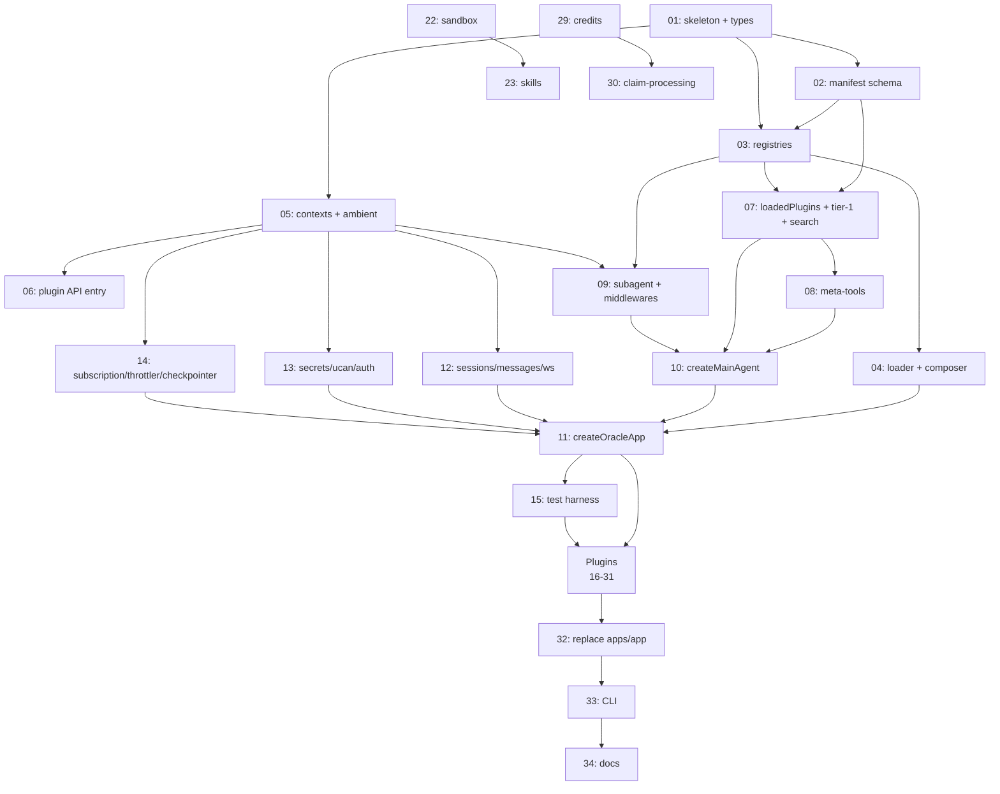

# ORA-219 Plugin Runtime — Implementation Tasks

This folder breaks the [ORA-219 plugin runtime spec](../ORA-219-plugin-based-runtime.md) into 34 trackable tasks.

The spec is the design. The tasks are how we ship it. **Read the spec first.** Tasks reference spec sections by `§N` and don't restate design decisions — if a task is ambiguous, the spec is the source of truth.

---

## How to use this folder

1. **Read [`../ORA-219-plugin-based-runtime.md`](../ORA-219-plugin-based-runtime.md)** end to end.
2. Find an unblocked task in the [Status table](#status-table) below (status `TODO` and all `Depends on` are `Done`).
3. Open the task file. Work through the **Acceptance** checklist.
4. Update the row in the Status table when you start (`In Progress`) and when you finish (`Done`).
5. Pick the next unblocked task.

Every task file follows the same shape — phase, spec sections, effort, dependencies, deliverables, acceptance criteria, out of scope, notes.

---

## How the work is sliced

Six phases, mapped to spec parts:

| Phase                         | Tasks             | Tasks count | Cumulative effort (1 eng) | Spec parts                                                  |
| ----------------------------- | ----------------- | ----------- | ------------------------- | ----------------------------------------------------------- |
| 1 — Foundation                | TASK-01 … TASK-06 | 6           | ~2 weeks                  | Parts II–III (types, manifest, registries, contexts)        |
| 2 — Discovery & Composition   | TASK-07 … TASK-11 | 5           | ~2 weeks                  | Parts III–IV (meta-tools, createMainAgent, createOracleApp) |
| 3 — Tier-0 module relocation  | TASK-12 … TASK-14 | 3           | ~1 week                   | §22.10                                                      |
| 4 — Testing harness           | TASK-15           | 1           | ~3 days                   | §20                                                         |
| 5 — Bundled plugin conversion | TASK-16 … TASK-31 | 16          | ~3 weeks                  | Part V, §16, §22.11                                         |
| 6 — Final integration         | TASK-32 … TASK-34 | 3           | ~1 week                   | §22.14, §22.15, §22.17                                      |

**Total: 34 tasks, ~9 weeks for one engineer, ~5 weeks parallelized with two.**

The slicing rules I followed:

- **One task = 1–5 focused days.** No half-day filler ("rename a file"); no two-week monsters.
- **Each task is independently verifiable.** Acceptance criteria are concrete checkboxes — code compiles, exports resolve, tests pass.
- **Sequential where it has to be, parallel where it can be.** Foundation and Composition phases are strictly sequential because each task's output is the next one's input. Tier-0 relocation, plugin conversions, and the testing harness are parallel.
- **Bundled plugins are one task each.** Sixteen plugins → sixteen tasks. Each is its own commit and has its own test surface.
- **Hard cascades are noted explicitly.** `skills` blocks until `sandbox` lands. `claim-processing` blocks until `credits` lands. Nothing else has hard order constraints in plugin conversion.

---

## Status table

Status: `TODO` → `In Progress` → `Done`. Special states: `Removed` (no longer needed), `Deferred` (parked pending design decision).

**Progress: 28 of 30 in-scope tasks done.** TASK-16 (langfuse) removed; TASK-18 (calls) and TASK-31 (tasks) deferred; TASK-30 (claim-processing) merged into TASK-29 (credits) — see notes below the table.

| ID                                                                | Task                                                            | Phase | Effort | Depends on | Blocks                 | Status                  |
| ----------------------------------------------------------------- | --------------------------------------------------------------- | ----- | ------ | ---------- | ---------------------- | ----------------------- |
| [TASK-01](TASK-01-package-skeleton.md)                            | Package skeleton + public types                                 | 1     | 1.5d   | —          | all                    | Done                    |
| [TASK-02](TASK-02-manifest-schema.md)                             | Manifest schema + validator                                     | 1     | 1d     | 01         | 03, 07                 | Done                    |
| [TASK-03](TASK-03-registries.md)                                  | Six registries                                                  | 1     | 2.5d   | 01, 02     | 04, 09, 10             | Done                    |
| [TASK-04](TASK-04-loader-composer.md)                             | Plugin loader + schema composer                                 | 1     | 3d     | 03         | 11                     | Done                    |
| [TASK-05](TASK-05-contexts-ambient.md)                            | Plugin & Runtime contexts + ambient services + scoped emitter   | 1     | 4d     | 01         | 06, 09, 10, 12, 13, 14 | Done                    |
| [TASK-06](TASK-06-plugin-api-entry.md)                            | Plugin API entry (class, POJO, tool helper)                     | 1     | 1.5d   | 05         | all plugin tasks       | Done                    |
| [TASK-07](TASK-07-loadedplugins-tier1-search.md)                  | `loadedPlugins` state + Tier-1 renderer + search                | 2     | 2d     | 02, 03     | 08, 10                 | Done                    |
| [TASK-08](TASK-08-meta-tools.md)                                  | Four meta-tools                                                 | 2     | 2d     | 07         | 10                     | Done                    |
| [TASK-09](TASK-09-subagent-middlewares.md)                        | `createSubagentAsTool` + 4 always-on middlewares (relocate)     | 2     | 2d     | 03, 05     | 10                     | Done                    |
| [TASK-10](TASK-10-createmainagent.md)                             | `createMainAgent` rewrite                                       | 2     | 5d     | 07, 08, 09 | 11                     | Done                    |
| [TASK-11](TASK-11-createoracleapp.md)                             | `createOracleApp` factory + `getNestApp`                        | 2     | 3d     | 04, 10     | 15, all plugin tasks   | Done                    |
| [TASK-12](TASK-12-modules-sessions-messages-ws.md)                | Sessions, Messages, WS modules relocate                         | 3     | 2d     | 05         | 11                     | Done                    |
| [TASK-13](TASK-13-modules-secrets-ucan-auth.md)                   | Secrets, UCAN, Auth modules relocate                            | 3     | 2d     | 05         | 11                     | Done                    |
| [TASK-14](TASK-14-modules-subscription-throttler-checkpointer.md) | Subscription, Throttler, Matrix checkpointer, Tier-0 env schema | 3     | 1.5d   | 05         | 11                     | Done                    |
| [TASK-15](TASK-15-testing-harness.md)                             | `createTestRuntime` + mocks                                     | 4     | 3d     | 11         | 16…31                  | Done                    |
| [TASK-16](TASK-16-langfuse-plugin.md)                             | Convert `langfusePlugin` (silent)                               | 5     | 1d     | 11, 15     | 32                     | Removed                 |
| [TASK-17](TASK-17-userpreferences-plugin.md)                      | Convert `userPreferencesPlugin` (silent)                        | 5     | 1d     | 11, 15     | 32                     | Done                    |
| [TASK-18](TASK-18-calls-plugin.md)                                | Convert `callsPlugin`                                           | 5     | 2d     | 11, 15     | 32                     | Deferred                |
| [TASK-19](TASK-19-composio-plugin.md)                             | Convert `composioPlugin`                                        | 5     | 2d     | 11, 15     | 32                     | Done                    |
| [TASK-20](TASK-20-firecrawl-plugin.md)                            | Convert `firecrawlPlugin`                                       | 5     | 1d     | 11, 15     | 32                     | Done                    |
| [TASK-21](TASK-21-domain-indexer-plugin.md)                       | Convert `domainIndexerPlugin`                                   | 5     | 1d     | 11, 15     | 32                     | Done                    |
| [TASK-22](TASK-22-sandbox-plugin.md)                              | Convert `sandboxPlugin`                                         | 5     | 1.5d   | 11, 15     | 23, 32                 | Done                    |
| [TASK-23](TASK-23-skills-plugin.md)                               | Convert `skillsPlugin` (depends on sandbox)                     | 5     | 2d     | 22         | 32                     | Done                    |
| [TASK-24](TASK-24-editor-plugin.md)                               | Convert `editorPlugin`                                          | 5     | 2.5d   | 11, 15     | 32                     | Done                    |
| [TASK-25](TASK-25-agui-plugin.md)                                 | Convert `aguiPlugin`                                            | 5     | 1.5d   | 11, 15     | 32                     | Done                    |
| [TASK-26](TASK-26-portal-plugin.md)                               | Convert `portalPlugin`                                          | 5     | 2d     | 11, 15     | 32                     | Done                    |
| [TASK-27](TASK-27-memory-plugin.md)                               | Convert `memoryPlugin` (with `sharedState.userProfile`)         | 5     | 2.5d   | 11, 15     | 32                     | Done                    |
| [TASK-28](TASK-28-slack-plugin.md)                                | Convert `slackPlugin`                                           | 5     | 2.5d   | 11, 15     | 32                     | Done                    |
| [TASK-29](TASK-29-credits-plugin.md)                              | Convert `creditsPlugin`                                         | 5     | 2d     | 11, 15     | 30, 32                 | Done                    |
| [TASK-30](TASK-30-claim-processing-plugin.md)                     | Convert `claimProcessingPlugin` (depends on credits)            | 5     | 2d     | 29         | 32                     | Merged into TASK-29     |
| [TASK-31](TASK-31-tasks-plugin.md)                                | Convert `tasksPlugin` (TasksModule + BullMQ + sub-agent)        | 5     | 5d     | 11, 15     | 32                     | Deferred                |
| [TASK-32](TASK-32-replace-app.md)                                 | Replace `apps/app/src/` with starter                            | 6     | 1d     | 16…31      | 33                     | TODO (split into 32a–e) |
| [TASK-33](TASK-33-cli-updates.md)                                 | CLI updates (`qiforge plugin new`, `env`, `inspect`)            | 6     | 3d     | 32         | 34                     | TODO                    |
| [TASK-34](TASK-34-documentation.md)                               | Documentation (READMEs + playbook + CLAUDE.md)                  | 6     | 2d     | 33         | —                      | TODO                    |

### Working philosophy — reuse, don't blindly copy

When converting plugins or rewiring runtime modules, the goal is to **reuse as much existing apps/app code as possible**, BUT only as long as it aligns with the plugin API. If a lifted file violates the plugin contracts (module-level singletons, direct `MatrixManager.getInstance()` or env reads, lifted providers that bypass `ctx.llm`/`ctx.matrix`/`ctx.ucan`/`ctx.config`, etc.), **stop and propose a reimplementation** before pressing on. Reimplementation requires explicit user confirmation. The tasks port (TASK-31) is the cautionary tale — it copy-pasted everything and ended up bypassing 5+ plugin contracts; we deferred and will rebuild properly. The right cadence: lift → check alignment → if it's clean keep it; if it isn't, surface the violation, propose the rewrite, get sign-off, then do it.

### Status notes

- **TASK-16 (langfuse) — Removed.** Replaced by `LANGSMITH_*` env vars on the base env schema. LangChain auto-wires tracing when set; no plugin needed.
- **TASK-18 (calls) — Deferred.** Has `@Controller('calls')`. The `getNestModules()` API extension that landed later would technically unblock it, but user decision to skip the calls plugin for now. Revisit alongside the tasks rebuild.
- **TASK-30 (claim-processing) — Merged into TASK-29 (credits).** The two plugins were inseparable: `claim-processing` hard-depends on `credits` (uses the same `TokenLimiter`, the same Redis, the same on-chain settlement path). `TokenLimiter` is stateless — two instances pointing at the same Redis are equivalent. Splitting them as separate plugins forced an awkward cross-plugin DI hop. Now the credits plugin owns the **enforcement** middleware (`createCreditsMiddleware`) AND the **settlement** cron (`ClaimProcessingModule`, returned from `getNestModules()` when both `redis` and `network` are set). Files relocated _within_ the runtime to `plugins/credits/`; no public API broken (only internal `ClaimProcessingPlugin` re-export removed).
- **TASK-31 (tasks) — Deferred for full rebuild.** A port attempt revealed the apps/app TasksModule is fundamentally incompatible with the new plugin contracts: it uses module-level singletons (`getActiveTasksService`), bypasses `ctx.matrix.*` (calls `MatrixManager.getInstance()` directly), bypasses `ctx.llm.get(role)` (lifts a custom provider), bypasses `ctx.config` (reads env directly), and runs workers as the oracle admin instead of threading per-user UCAN. Workers also don't actually integrate with the memory plugin's tool surface (the soft-dep is a stub). The port was abandoned; reimplementation should: (1) use `ctx.matrix`/`ctx.llm`/`ctx.ucan`/`ctx.config` throughout, (2) re-enter the agent via the runtime's `MainAgentGraph` with a proper per-user `RuntimeContext`, (3) wire memory soft-dep via `ctx.availablePlugins.has('memory')` + actual memory tool calls, (4) ship `TasksModule` via `getNestModules()` (the API hook now exists). Pure-data files from the port (task-doc, task-page-template, task-meta, template-registry, scheduler types, the 3 lifted unit specs) are reusable; runtime-layer files must be rewritten.
- **Runtime API additions during execution:**
  - `getRequestSubAgents(rtCtx)` / `getRequestTools(rtCtx)` — for state-aware plugins (agui, portal)
  - `getNestModules()` — for plugins shipping NestJS modules (slack landed using this; tasks rebuild will use it)
  - `UcanAdapter.resolveServiceDid(url)` — exposed so plugins don't roll their own did:web resolution

### Bootstrap pattern: `OracleRuntimeBundleHolder`

The plugin runtime has a chicken-and-egg between Nest's DI lifecycle and `createOracleApp`:

1. `createOracleApp` calls `NestFactory.create(RuntimeAppModule)` — Nest constructs every `@Injectable()` here, including `MessagesService`.
2. Right after, `createOracleApp` builds `AmbientServices` (UcanAdapter, MatrixAdapter, etc.) using `nestApp.get(UcanService)` etc. — so ambient can't exist until AFTER Nest boots.
3. But `MessagesService` (constructed in step 1) needs `ambient` + `registries` + `identity` to call `createMainAgent` per request.

The Holder is the workaround:

```ts
@Injectable()
class OracleRuntimeBundleHolder {
  private bundle = null;
  populate(b) {
    this.bundle = b;
  } // called by createOracleApp post-bootstrap
  get() {
    return this.bundle;
  } // called by MessagesService per request
}
```

Nest constructs the holder empty in step 1; `createOracleApp` populates it in step 2; consumers read in step 3+ via DI. This pattern (also called "deferred provider" / "post-init container") is the standard escape hatch when external bootstrap code needs to push values into Nest-managed services AFTER `NestFactory.create` resolves.

Alternatives considered and rejected: `useFactory` providers (chicken-egg between ambient and DI), passing through `RuntimeAppModule.register({...})` (can't satisfy ambient's UcanService dependency), module-level singletons (hides global state, breaks test isolation). The holder is the simplest workable shape.

### Beyond-spec work delivered in addition to the 34 tasks

These weren't in the original spec but landed during execution:

- **Runtime API extension** — `getRequestSubAgents(rtCtx)` and `getRequestTools(rtCtx)` on `OraclePlugin` (request-time builder hooks for plugins that need state-aware tool/sub-agent registration, e.g. agui's `state.agActions`, portal's `state.browserTools`).
- **`UcanAdapter.resolveServiceDid`** — exposed on the adapter interface + `RuntimeContext.ucan`. Plugins use `ctx.ucan.resolveServiceDid(url)` instead of rolling their own did:web resolution.
- **Memory passthrough** — runtime filter in `createMainAgent` propagates non-destructive memory CRUD tools (search/save/read/delete) to every sub-agent. `clear_memory` stays main-agent-only. No new plugin API.
- **`defaultToAgentSpec` bug fix** — was NOOP'ing inner tools and dropping `subAgent.model`. Now uses `wrapPluginTool` + `ambient.llm.get(role)` so plugin sub-agents actually execute in production.
- **Cleanup passes** — domain-indexer NETWORK-based URL lookup, user-preferences userName field + `set_user_preferences` tool + trimmed formality enum, credits `Redis` from ioredis directly (dropped `CreditsRedisClient` port + provider wrapper), `SKIP_LOGGING_CHAT_HISTORY_TO_MATRIX` removed across the repo.

---

## Dependency graph



---

## Phase notes

### Phase 1 — Foundation (TASK-01 … TASK-06)

Strictly sequential. Each task adds the type and infrastructure the next one consumes. Outputs:

- A working `@ixo/oracle-runtime` package with public exports.
- A validated `PluginManifest` schema.
- Six populated registries with collision detection.
- A plugin loader that resolves features + bundled + user plugins, topo-sorts, and validates env via merged Zod schemas.
- `PluginContext` and `RuntimeContext` synthesized correctly per build / per request.
- The class-based `OraclePlugin` API + the `defineOraclePlugin` POJO helper + `tool()` helper.

By end of Phase 1, you can write a stub plugin and have it loaded, its types resolved, its context provided. Nothing functional yet.

### Phase 2 — Discovery & Composition (TASK-07 … TASK-11)

Strictly sequential. Outputs:

- The `loadedPlugins` state field (the only addition to `apps/app/src/graph/state.ts`).
- The Tier-1 prompt renderer (alphabetical, ≤ 1500 token budget).
- The TF-IDF search index for `find_capability`.
- The four built-in meta-tools (`find_capability`, `load_capability`, `list_capabilities`, `list_capability_details`).
- Today's `createSubagentAsTool` and 4 always-on middlewares relocated.
- A working `createMainAgent` (~250 lines, replacing today's 1052) that produces a compiled agent given registries, plugin context, and request context.
- `createOracleApp` factory that bootstraps Nest, runs plugin loaders, returns an `OracleApp` with `getNestApp()`, `beforeListen`, `onPluginStatusChange`, `listen`.

By end of Phase 2, the runtime can boot. There are no plugins migrated yet — Phase 5 fills that in.

### Phase 3 — Tier-0 module relocation (TASK-12 … TASK-14)

Three parallel tasks that move existing NestJS modules into the runtime package. **No logic changes.** `git mv` (or equivalent rename) preserves history. The runtime imports them directly into the `RuntimeAppModule`.

### Phase 4 — Testing harness (TASK-15)

`createTestRuntime` per §20. Just enough to write per-plugin tests during Phase 5. Lightweight — no LLM fixtures, no plug-matrix property tests.

### Phase 5 — Bundled plugin conversion (TASK-16 … TASK-31)

Sixteen tasks, mostly parallel. Each takes one feature from `apps/app/src/<area>/` and turns it into a plugin class under `packages/oracle-runtime/src/plugins/<name>/`. Two hard cascades: skills depends on sandbox (§16); claim-processing depends on credits (§16).

Each task migrates the existing code via `git mv`, wraps it in a class extending `OraclePlugin`, declares the manifest, exposes shared state if any, and adds a basic test using `createTestRuntime`.

### Phase 6 — Final integration (TASK-32 … TASK-34)

After all bundled plugins land, delete `apps/app/src/` and replace with a 30-line starter. Update CLI (`qiforge plugin new`, `qiforge env`, `qiforge inspect`). Refresh docs. Land in one PR — that's the cleanliness payoff.

---

## Conventions

- **Status tracking:** the table above is the source of truth. Update the row when you start or finish.
- **Spec references:** any time a task is ambiguous, search the spec for the cited `§N` and read it. Do not invent design.
- **Acceptance:** every checkbox in a task's Acceptance section must pass before marking Done. If a checkbox is impossible, surface a question rather than skipping.
- **Out-of-scope:** read the Out of scope section in each task before starting. Don't accidentally do work that belongs in another task.
- **`git mv`:** prefer `git mv` (or rename detection) when relocating files so blame survives.
- **Tests:** plugin conversion tasks (16–31) require at least one unit test using `createTestRuntime`. Framework tasks (1–11) require their public exports to compile and resolve from a sibling test file.

---

## What's NOT in this folder

- New design decisions. The spec is the design.
- Storage / Matrix scaling work. That's tracked separately in [`../matrix-storage-architecture-review.md`](../matrix-storage-architecture-review.md).
- Versioning policy (stability tiers, codemods, changelog format). The spec defers these to a follow-up ticket; nothing here covers them.
- LLM determinism (recorded fixtures), plug-matrix property tests, coverage gates, cross-version CI. The spec scopes these out of v1; the test harness in TASK-15 stays basic.
- Any plugin work for plugins not in §16's catalog. If a fork wants a custom plugin, that's their work after the runtime ships.
