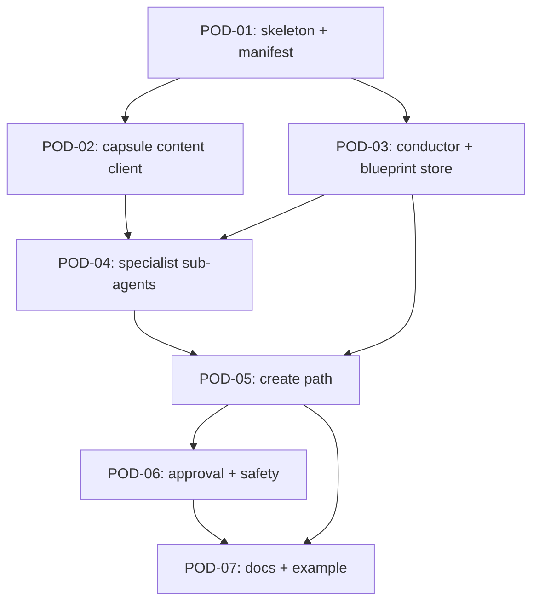

# POD‑Creator Plugin — Implementation Tasks

Breaks the [POD‑Creator plugin spec](../../pod-creator-plugin.md) into seven trackable tasks.

The spec is the design. These tasks are how we ship it. **Read the spec first** — `§N` references
point to its numbered sections. Tasks don't restate design decisions; if a task is ambiguous, the
spec is the source of truth.

> **Self‑contained workstream.** This is **not** part of ORA‑219 ([`../README.md`](../README.md)) —
> it's the custom POD‑creator plugin, tracked against its own spec. All code here is **net‑new**;
> there's nothing to `git mv` from `apps/app/`.

---

## How to use

1. Read [`../../pod-creator-plugin.md`](../../pod-creator-plugin.md) end to end.
2. Pick an unblocked task (status `TODO`, all `Depends on` are `Done`).
3. Work the **Acceptance** checklist. Update the row when you start (`In Progress`) and finish (`Done`).

---

## Status table

Status: `TODO` → `In Progress` → `Done`.

| ID                                            | Task                                               | Phase | Effort | Depends on     | Blocks         | Status |
| --------------------------------------------- | -------------------------------------------------- | ----- | ------ | -------------- | -------------- | ------ |
| [POD‑01](POD-01-skeleton.md)                  | Plugin skeleton + manifest                         | 1     | 1.5d   | —              | all            | TODO   |
| [POD‑02](POD-02-capsule-content-client.md)    | Capsule content client                             | 1     | 2d     | POD‑01         | POD‑04         | TODO   |
| [POD‑03](POD-03-conductor-blueprint-store.md) | Conductor + blueprint store                        | 2     | 3d     | POD‑01         | POD‑04, POD‑05 | TODO   |
| [POD‑04](POD-04-specialist-subagents.md)      | Specialist sub‑agents (per‑stage, registry‑loaded) | 2     | 3d     | POD‑02, POD‑03 | POD‑05         | TODO   |
| [POD‑05](POD-05-create-path.md)               | Create path (prepare → sign → confirm)             | 3     | 4d     | POD‑03, POD‑04 | POD‑06         | TODO   |
| [POD‑06](POD-06-approval-safety.md)           | Approval gate + network safety                     | 3     | 2d     | POD‑05         | POD‑07         | TODO   |
| [POD‑07](POD-07-docs-example.md)              | Docs + example wiring                              | 4     | 2d     | POD‑05, POD‑06 | —              | TODO   |

**Total: 7 tasks, ~17.5 days for one engineer** (POD‑02 ∥ POD‑03 shave ~2 days when parallelized).

Phases: **1 — Foundation** (01, 02) · **2 — Conductor & specialists** (03, 04) ·
**3 — Creation** (05, 06) · **4 — Integration & docs** (07).

---

## Dependency graph

---

## Conventions

- **Net‑new, no `git mv`.** Nothing ports from `apps/app/`; build against the plugin API directly.
- **Reuse runtime services.** Go through `ctx.llm` / `ctx.matrix` / `ctx.ucan` / `ctx.config` /
  `ctx.blobStore` / `ctx.emit` — don't roll your own. If a piece would bypass a plugin contract,
  stop, surface it, propose the rewrite, get sign‑off.
- **Repo rules apply.** No type assertions to satisfy the compiler (parse, don't `as`); integration
  tests throw on missing env (no `describe.skipIf`); no skip‑real‑services flags; no task/spec
  metadata in source comments.
- **Tests.** Every task ships at least one test via `createTestRuntime`
  (`packages/oracle-runtime/src/testing/create-test-runtime.ts`).
- **Status table here is the source of truth.** Update the row when you start or finish.

## Build‑phase prerequisites (from spec §12)

- **Full role skill text** — POD‑04 needs each `design-pod-*` `SKILL.md` + the orchestration
  blueprint / `stage-routing` / `specialist-handoff` / `readiness-progression` references +
  `templates/orchestration-payloads.yaml` to port each role's tools and the `service_pod_blueprint`
  shape precisely. Obtain via repo‑add (`ai-skills-private`) or paste.
- **Capsule content‑fetch path** — POD‑02 confirms whether `SKILL.md` text is served by a content
  endpoint or only via sandbox `load_skill`.
- **Portal `sign_transaction` handler** — POD‑05/07 depend on the consuming app providing the
  wallet signer; until then the create path runs on testnet with a test signer.
